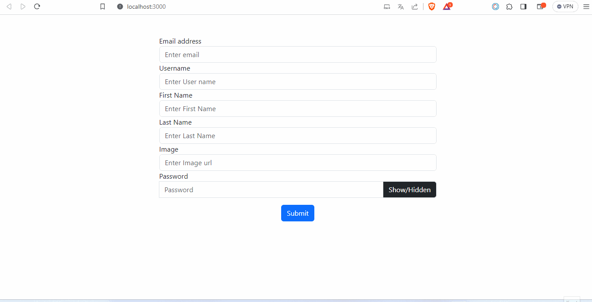

# Form Validasyon Uygulaması

## Beklenen Çıktı

## Canlı Uygulama

[Form Validation](https://form-validation-ass5.vercel.app/)

## İstenenler

- Validasyon => 
    - Tüm alanların doldurulması, 
    - passwordun en az 8 haneli olması, 
    - emailin valid olması => @ içermesi, @ işaretinden sonra 2 veya 3 basamaklı olması, 
    - image in url olması
    - username,firstname ve lastname bilgilerinin boşluklar hariç en az 3 karakter olması
- Eğer kullanıcı validasyonu sağlamadan butona yönelirse kullanıcının butonu tıklayabilmesinin engellenmesi. Örnekte olduğu gibi butonun harekete geçmesi ve disabled olması olabilir. Butondan ayrıldığında tekrar butonun sabitlenmesi ve aktif hale gelmesi
- Form submit olduğunda bilgilerin altta card yapısı halinde sergilenmesi ve formdaki inputların boşaltılması.
- Show/Hidden butonuna tıklanıldığında passwordun sergilenip sergilenmemesinin ayarlanması.

## Bonus 
- Validasyon koşullarını ekranda sergileyebilirsiniz. 
- Her ekleneni ekleyip ekranda sergileyebilirsiniz.